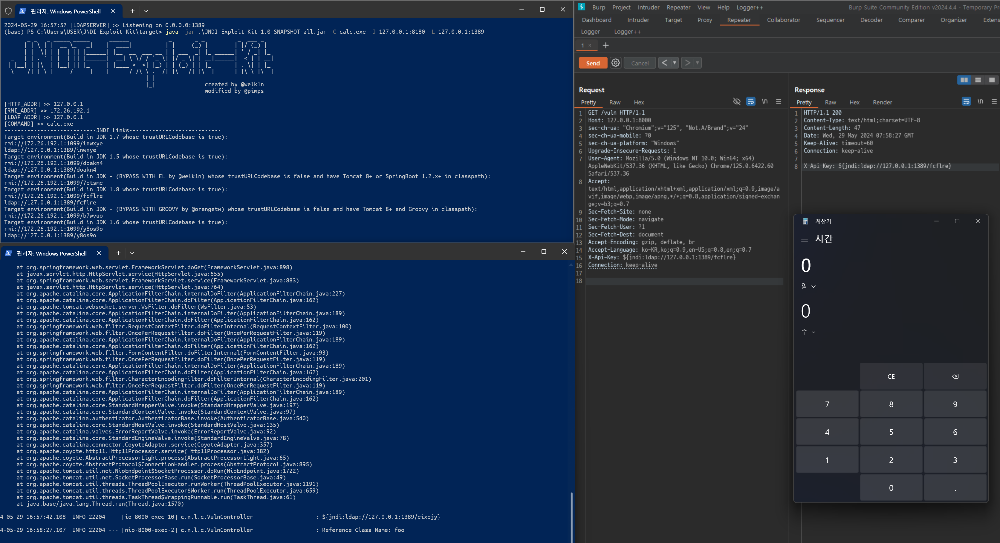

# ☕ Log4Shell PoC Application
Spring framework based web application for proof of concept for log4shell vulnerabilities

## Install & Launch
> [!Important]
> JDK 1.8(8u131 in development) is required to launch this project

There is already an application built with the .jar extension in the 'build/libs/' path, so you don't need to build it.
```shell
$ java -jar Log4Shell-PoC-Application/build/libs/Log4Shell-PoC-Application-0.0.1-SNAPSHOT.jar
```
You can also edit 'src/main/application.properties' to change the port:   
(If you change the port, you need to build it again.)
```text
# application.properties
server.port = 8080
```

## Proof of Concept 
To test for vulnerabilities in this application, you must send a GET request by inserting the payload into the `X-Api-Key header` in the `/vuln` path.
